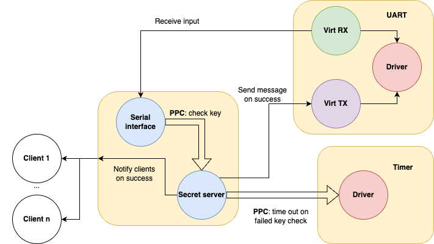

<!--
    Copyright 2026, UNSW

    SPDX-License-Identifier: BSD-2-Clause
-->

# Acacia sDDF demo

This demo showcases the usage of [Acacia](https://github.com/au-ts/microkit_acacia/) for the seL4 Summit 2026. The demo system
is a simple Acacia subsystem demonstrating how to exercise most Microkit primitives
and how to utilise drivers from the sDDF using Acacia.



## Dependencies

### Build system and QEMU

On apt based Linux distributions run the following commands:

```sh
sudo apt install make clang llvm lld device-tree-compiler python3 python3-pip gcc-aarch64-linux-gnu qemu-system-arm
```

On macOS, you can install the dependencies via Homebrew:
```sh
brew install llvm lld make dtc python3 qemu
```
(You may also need to add llvm to your PATH, something like `export PATH=$PATH:/opt/homebrew/Cellar/llvm/20.1.8/bin` ... the path will vary depending on your system).

### Microkit

You also need a copy of the seL4 Microkit for your system. Download a copy for your architecture
and OS @ https://github.com/seL4/microkit/releases/tag/2.3.0.

Extract the archive and use the absolute path to the extracted files when invoking Make.

### sDDF and Acacia

The `Makefile` in this project will automatically download and install the sDDF and Acacia.


## Building

The following platforms are supported:

* qemu_virt_aarch64
* qemu_virt_riscv64

### Make

To run the demo:
```sh
make MICROKIT_BOARD=qemu_virt_aarch64 MICROKIT_SDK=${MICROKIT_PATH} MICROKIT_CONFIG=debug qemu
```

More generally:
```sh
make MICROKIT_SDK=<path/to/sdk> MICROKIT_BOARD=<board> MICROKIT_CONFIG=<debug/release/benchmark>
```

After building, the system image to load will be `build/loader.img`.

If you wish to simulate on one of the QEMU platforms (qemu_virt_aarch64 or
qemu_virt_riscv64), you can append `qemu` to your make command to start QEMU
after everything compiles.


## Description

This example demonstrates the creation of a simple Acacia subsystem, showcasing:
* Creation of PDs, MRs, channels inside of a subsystem,
* Creating connections with clients in the form of channels,
* Composing a subsystem using other subsystems, i.e. having our subsystem use the sDDF serial and timer subsystem,
* Creating configuration structs and showing how to pass data from Acacia to compiled C programs.

The subsystem contains two PDs: a serial interface and a secret server.
* The serial interface accepts user input from the sDDF serial class and forwards it to the secret server as a key when Enter is pressed.
* The secret server compares the key against a stored secret. If the key matches, the secret server prints its secret message and notifies all clients. Otherwise, it will time out for some amount of time and block the serial interface from being able to accept new data.

The clients are extremely simple, they just await a notification and print a success message when it comes.

## More info

See:
* [sDDF](https://github.com/au-ts/sddf)
* [Acacia](https://github.com/au-ts/microkit_acacia/)
